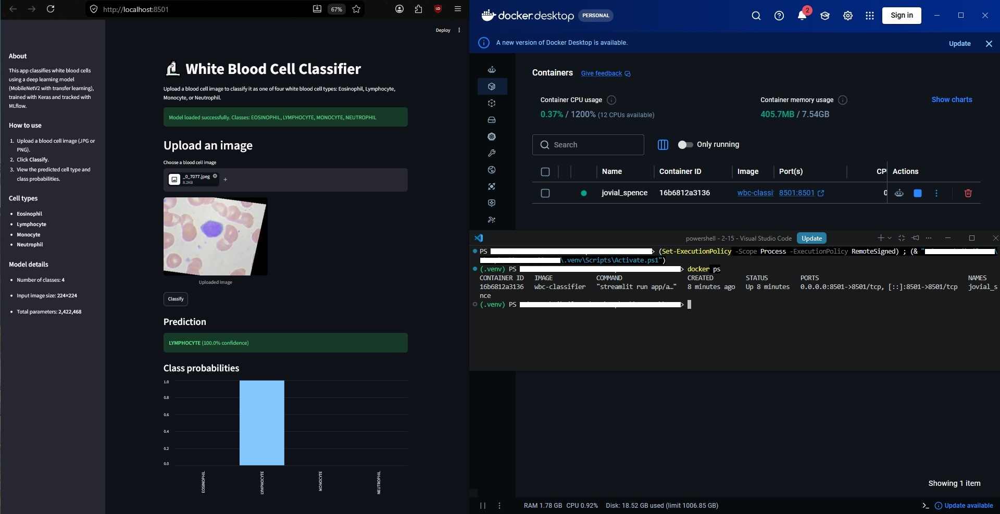
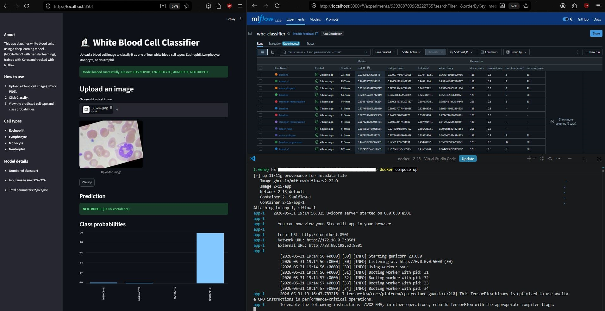
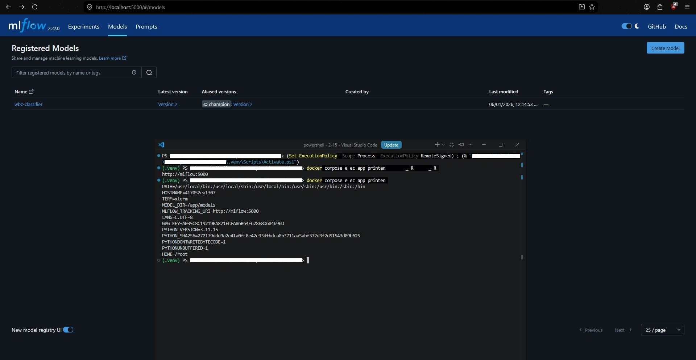
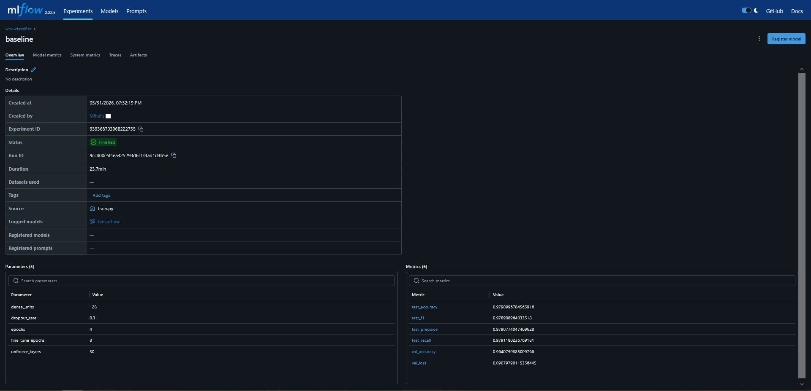

# White Blood Cell Classifier — MLOps Pipeline

## Overview

An end-to-end MLOps system that classifies white blood cells into four
types — Eosinophil, Lymphocyte, Monocyte, and Neutrophil — from microscope
images. A MobileNetV2 transfer-learning model is trained with Keras, every
experiment is tracked in MLflow, the best model is registered and tagged as
`champion`, and a Streamlit app loads that model directly from the MLflow
Model Registry to serve predictions. The whole system runs in Docker via
Docker Compose, with the Streamlit app and the MLflow tracking server as two
connected services.

The project demonstrates that the model is not only trained, but integrated
into a usable and reproducible system.



## Technologies Used

- **Python** — core language
- **TensorFlow / Keras** — deep learning, MobileNetV2 transfer learning
- **MLflow** — experiment tracking and Model Registry (versioning)
- **scikit-learn** — precision, recall, and F1-score metrics
- **Streamlit** — interactive web app for predictions
- **Pillow / NumPy** — image preprocessing
- **Docker / Docker Compose** — containerization and multi-service orchestration
- **VS Code** — development environment

## Setup

### Requirements

- Python 3.11
- Docker Desktop (for the containerized setup)
- The Blood Cell Images dataset (see *Dataset* below)

### Install dependencies (local development)

```bash
python -m venv .venv
.venv\Scripts\activate        # Windows
pip install -r requirements.txt
```

### Prepare the data

Download the Blood Cell Images dataset and combine the original `TRAIN` and
`TEST` folders into one folder per class under `data/combined/`:

```
data/combined/EOSINOPHIL/
data/combined/LYMPHOCYTE/
data/combined/MONOCYTE/
data/combined/NEUTROPHIL/
```

The training script then splits this 70/15/15 into train / validation / test.

## How to Run

### 1. Train the model

Logs experiments to MLflow, selects the best run by F1-score, and registers
it as `champion`:

```bash
python src/train.py
```

To log to a running MLflow server instead of local files, set:

```bash
$env:MLFLOW_TRACKING_URI = "http://localhost:5000"   # Windows PowerShell
python src/train.py
```

### 2. View experiments in MLflow

```bash
mlflow ui
```

Then open `http://localhost:5000`.

### 3. Run the Streamlit app

```bash
streamlit run app/app.py
```

Then open `http://localhost:8501`.

### 4. Run everything with Docker Compose (recommended)

Builds and starts both the MLflow server and the Streamlit app:

```bash
docker compose up
```

- Streamlit app: `http://localhost:8501`
- MLflow UI: `http://localhost:5000`

Both services running together via Docker Compose — the Streamlit app, the
MLflow experiment table, and the `docker compose up` logs:



## Project Structure

```
wbc-classifier/
├── src/
│   └── train.py            # Training, MLflow logging, best-model selection + registration
├── app/
│   └── app.py              # Streamlit app — loads the champion model from MLflow
├── models/
│   ├── best_model.keras    # Saved best model (local copy)
│   └── class_names.json    # Class label order
├── data/
│   └── combined/           # Images organized into one folder per class
├── .streamlit/
│   └── config.toml         # Streamlit server config (host, port, headless)
├── Dockerfile              # Image for the Streamlit app
├── docker-compose.yml      # Two services: app + mlflow
├── .dockerignore
├── requirements.txt
└── README.md
```

## How the Model Is Loaded

The model is never hard-coded into the app. Instead:

- `src/train.py` registers the best model in the **MLflow Model Registry**
  under the name `wbc-classifier` and tags it with the `champion` alias.
- `app/app.py` loads the model via `models:/wbc-classifier@champion`, so it
  always uses whichever model is currently the best — no file path is hard-coded.
- The MLflow server location is read from the `MLFLOW_TRACKING_URI` environment
  variable (`http://mlflow:5000` inside Docker, `http://localhost:5000` locally),
  and the model folder from `MODEL_DIR`. Both are configurable, not hard-coded.
- If the model cannot be loaded (e.g. the MLflow service is down), the app
  shows a clear error message instead of crashing.

The MLflow Model Registry showing the registered model with the `champion`
alias, alongside the app container's environment variables:



## Model

### Architecture
- **Base:** MobileNetV2 (pretrained on ImageNet), frozen for the warm-up phase
- **Head:** GlobalAveragePooling → Dropout → Dense → Dropout → Dense(4, softmax)
- **Fine-tuning:** the top layers of MobileNetV2 are unfrozen and trained with
  a very low learning rate so the model adapts to blood-cell images
- **Regularization:** dropout + data augmentation (flip, rotation, zoom, contrast)

### Metrics (best model — `baseline`)
| Metric | Value |
|---|---|
| Accuracy | 0.963 |
| Precision | 0.966 |
| Recall | 0.963 |
| F1-score | 0.963 |

The MLflow run details for the best model, showing logged parameters and metrics:



## Experiments

Three experiments were run with different hyperparameters; the best was
selected automatically by F1-score and registered as `champion`.

| Experiment | Dropout | Dense units | Unfrozen layers | Test F1 |
|---|---|---|---|---|
| baseline | 0.3 | 128 | 30 | **0.963** |
| more_dropout | 0.5 | 128 | 30 | 0.919 |
| larger_head | 0.4 | 256 | 40 | 0.231 |

**Key finding:** unfreezing more layers (40 instead of 30) made the model
*worse*, not better — `larger_head` became unstable (validation loss spiked)
and EarlyStopping halted it. With a few thousand images and short fine-tuning,
unfreezing too much of the base destroys useful pretrained features faster than
the model can relearn them. This is visible across the MLflow runs.

## A Note on Accuracy

This dataset consists of ~12,000 augmented images derived from a small set of
originals. The original `TRAIN`/`TEST` split led to misleading results (high
validation, low test) because augmented variations of the same source images
were spread unevenly. Combining all images and re-splitting 70/15/15 — standard
practice for this dataset — produces consistent, high accuracy. Some of this
high score comes from augmented variations appearing across splits; the score
reflects performance under that standard setup.

## Challenges & Solutions

| Problem | Solution |
|---|---|
| Frozen MobileNetV2 only reached ~53% on blood cells | Added two-phase fine-tuning (warm-up head, then unfreeze top layers) |
| Validation looked good but test was poor | Diagnosed a data-split issue; combined TRAIN+TEST and re-split 70/15/15 |
| Aggressive fine-tuning caused overfitting | Lower learning rate, data augmentation, `ReduceLROnPlateau`, EarlyStopping |
| Model path hard-coded in the app | Made it configurable via the `MODEL_DIR` / `MLFLOW_TRACKING_URI` env vars |
| App needed the latest best model automatically | Loaded the `champion` model from the MLflow Model Registry |
| App unreachable inside Docker | Set Streamlit `address = 0.0.0.0` in `.streamlit/config.toml` |

## Key Concepts Demonstrated

- **Transfer learning** — adapting a pretrained CNN to a new image domain
- **Two-phase fine-tuning** — warm-up head training, then careful base unfreezing
- **Experiment tracking** — logging parameters, metrics, and models to MLflow
- **Model versioning** — registering models and promoting the best via an alias
- **Service integration** — Streamlit loading a model from MLflow over the network
- **Containerization** — multi-service deployment with Docker Compose
- **Configuration via environment variables** — no hard-coded paths or hosts
- **Reproducibility** — clear structure, separate training and serving, pinned deps
